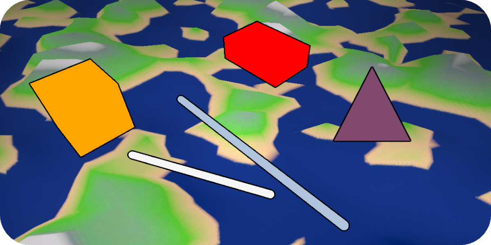

<p align="center" width="100%">
    <h1 align="center"> Introduction  </h1>
</p>

In Godot 2D you can use a Draw2D function to draw lines and other shapes in the scene. </br>
But in 3D we don’t have a corresponding method, Draw3D just doesn’t exist. </br>
This guide will focus on adding this missing function to your Godot project. </br>
</br>

<p align="center" width="100%">

</p>

</br>

This page was largely inspired by [Ryan Mirch's Draw3D script](https://github.com/Ryan-Mirch/Line-and-Sphere-Drawing). </br>
[[GD script youtube tutorial]](https://www.youtube.com/watch?v=JnrhURF1jgM) </br>
</br>

## Adding Draw3D
Start by creating a C# script anywhere in your project. </br>
Name the script “Draw3D.cs” and paste the following code into the script: </br>
```cs
using Godot;

public partial class Draw3D : Node3D
{
    public static MeshInstance3D Line(Vector3 from, Vector3 to, Color? color = null)
    {
        var meshInstance = new MeshInstance3D();
        var immediateMesh = new ImmediateMesh();
        var material = new StandardMaterial3D();

        meshInstance.Mesh = immediateMesh;
        meshInstance.CastShadow = GeometryInstance3D.ShadowCastingSetting.Off;

        immediateMesh.SurfaceBegin(Mesh.PrimitiveType.Lines, material);
        immediateMesh.SurfaceAddVertex(from);
        immediateMesh.SurfaceAddVertex(to);
        immediateMesh.SurfaceEnd();

        material.ShadingMode = StandardMaterial3D.ShadingModeEnum.Unshaded;
        material.AlbedoColor = color ?? Colors.WhiteSmoke;

        (Engine.GetMainLoop() as SceneTree).Root.CallDeferred("add_child", meshInstance);

        return meshInstance;
    }

    public static MeshInstance3D Point(Vector3 position, float radius = 0.05f, Color? color = null)
    {
        var meshInstance = new MeshInstance3D();
        var sphereMesh = new SphereMesh();
        var material = new StandardMaterial3D();

        meshInstance.Mesh = sphereMesh;
        meshInstance.CastShadow = GeometryInstance3D.ShadowCastingSetting.Off;
        meshInstance.Position = position;

        sphereMesh.Radius = radius;
        sphereMesh.Height = radius * 2f;
        sphereMesh.Material = material;

        material.ShadingMode = StandardMaterial3D.ShadingModeEnum.Unshaded;
        material.AlbedoColor = color ?? Colors.WhiteSmoke;

        (Engine.GetMainLoop() as SceneTree).Root.CallDeferred("add_child", meshInstance);

        return meshInstance;
    }
}
```
*(This script doesn’t need to be appended to any nodes in the scene)* </br>
</br>
Now you should have two new methods to work with: </br>
```cs
Draw3D.Line();
Draw3D.Point();
```
</br>

## Using Draw3D.Line()
To draw a line you’ll need to specify where it starts and where it ends: </br>
```cs
public override void _Ready()
{
    Vector3 from = new Vector3(-2,1,2);
    Vector3 to = new Vector3(2,1,-2);
    Draw3D.Line(from,to);
}
```
If you run this code, you should see a white line appear. </br>


</br>
You can also change its [color](https://docs.godotengine.org/en/stable/classes/class_color.html) like this: </br>
```cs
Vector3 from = new Vector3(-2,1,2);
Vector3 to = new Vector3(2,1,-2);
Draw3D.Line(from,to,Colors.Red);
```
Now you’ll have a red line. </br>


## Using Draw3D.Point()
You'll need to specify a position, and optionaly a size and color. </br>
```cs
Vector3 position = new Vector3(0,1,0);
Draw3D.Point(position,0.1f,Colors.Orange);
```

</br>

## Script Explanation
This section will explain what the Draw3D.cs script does and how to change it to suit your needs. </br>

*First we declare our types:* </br>
[meshInstance](https://docs.godotengine.org/en/stable/classes/class_meshinstance3d.html#class-meshinstance3d) – a representation of an object in our scene. </br>
[immediateMesh](https://docs.godotengine.org/en/stable/classes/class_meshinstance3d.html) – a representation of the mesh’s shape/vertex data. </br>
[[More on how to use ImmediateMesh]](https://docs.godotengine.org/en/stable/tutorials/3d/procedural_geometry/immediatemesh.html) </br>
[material](https://docs.godotengine.org/en/stable/classes/class_material.html) – a representation of the mesh’s texture. </br>
```cs
var meshInstance = new MeshInstance3D();
var immediateMesh = new ImmediateMesh();
var material = new StandardMaterial3D();
```

Apply the immediateMesh *(shape)* to our meshInstance *(object)*. </br>
```cs
meshInstance.Mesh = immediateMesh;
```

Disable the mesh’s shadows. </br>
```cs
meshInstance.CastShadow = GeometryInstance3D.ShadowCastingSetting.Off;
```

To begin generating geometry call SurfaceBegin(), it takes a [PrimitiveType](https://docs.godotengine.org/en/stable/classes/class_primitivemesh.html) argument. </br>
```cs
immediateMesh.SurfaceBegin(Mesh.PrimitiveType.Lines, material);
```

Add vertices to our immediateMesh. </br>
```cs
immediateMesh.SurfaceAddVertex(from);
immediateMesh.SurfaceAddVertex(to);
```

To stop generating geometry call SurfaceEnd(). </br>
```cs
immediateMesh.SurfaceEnd();
```

ShadingMode – Remove self shadow, so our shape’s color will be uniform. </br>
AlbedoColor – Set the default color to be Colors.WhiteSmoke. </br>
```cs
material.ShadingMode = StandardMaterial3D.ShadingModeEnum.Unshaded;
material.AlbedoColor = color ?? Colors.WhiteSmoke;
```

Adds the meshInstance to our scene’s root node, therefor drawing a line. </br>
```cs
(Engine.GetMainLoop() as SceneTree).Root.CallDeferred("add_child", meshInstance);
```

## Script Explanation - Draw3D.Point()
Instead of immediateMesh we can use a [SphereMesh](https://docs.godotengine.org/en/3.0/classes/class_spheremesh.html). </br>
```cs
var sphereMesh = new SphereMesh();
```

Set the meshInstance’s shape to sphereMesh, and set its position. </br>
```cs
meshInstance.Mesh = sphereMesh;
meshInstance.Position = position;
```

Set the sphere’s radius/*(width)*, height and material. </br>
```cs
sphereMesh.Radius = radius;
sphereMesh.Height = radius * 2f;
sphereMesh.Material = material;
```
</br>

## Extra Draw3D Shapes
### Box (with transparency)
Use example: </br>
```cs
Draw3D.Box(position,new Vector3(2,0.5f,1));
```
Draw3D.cs code:
```cs
public static MeshInstance3D Box(Vector3 position, Vector3? size = null, Color? color = null)
    {
    var meshInstance = new MeshInstance3D();
    var boxMesh = new BoxMesh();
    var material = new StandardMaterial3D();

    meshInstance.Mesh = boxMesh;
    meshInstance.CastShadow = GeometryInstance3D.ShadowCastingSetting.Off;
    meshInstance.Position = position;

    boxMesh.Size = size ?? new Vector3(0.5f,0.5f,0.5f);
    boxMesh.Material = material;

    material.ShadingMode = StandardMaterial3D.ShadingModeEnum.Unshaded;
    material.Transparency = BaseMaterial3D.TransparencyEnum.Alpha;
    material.AlbedoColor = color ?? Color.Color8(100,100,100,100);
        
    (Engine.GetMainLoop() as SceneTree).Root.CallDeferred("add_child", meshInstance);

    return meshInstance;
}
```
In the material section to make a shape transparent we can set its alpha mode. </br>
We can also change its color with [Color8](https://docs.godotengine.org/en/stable/classes/class_%40gdscript.html#method-descriptions): </br>
```cs
material.Transparency = BaseMaterial3D.TransparencyEnum.Alpha;
material.AlbedoColor = color ?? Color.Color8(100,100,100,100);
```


### 3D Axis
Use example: </br>
```cs
Draw3D.Axis(position,1f); // (position,axis length)
```
Draw3D.cs code:
```cs
public static Node3D Axis(Vector3 position, float length = 0.5f)
{
    Node3D helper_node = new Node3D();

    var meshInstance_AxisUp = Line(position,position + Vector3.Up * length, Colors.WebGreen);
    var meshInstance_AxisLeft = Line(position,position + Vector3.Left * length, Colors.Red);
    var meshInstance_AxisForward = Line(position,position + Vector3.Forward * length, Colors.NavyBlue);

    meshInstance_AxisUp.CallDeferred("reparent",helper_node);
    meshInstance_AxisLeft.CallDeferred("reparent",helper_node);
    meshInstance_AxisForward.CallDeferred("reparent",helper_node);

    (Engine.GetMainLoop() as SceneTree).Root.CallDeferred("add_child", helper_node);

    return helper_node;
}
```
In this example we create a ‘helper_node’ which contains all of our geometry data. </br>


### Beam (Thick line)
Use example:
```cs
Draw3D.Beam(from,to,0.05f,Colors.Aquamarine,32,4); // (start pos, end pos, width, color, segments, rings)
```
Draw3D.cs code:
```cs
public static Node3D Beam(Vector3 from, Vector3 to, float thickness = 0.05f, Color? color = null, int segments = 32, int rings = 4)
{
    if (to == from)
    {
        GD.PrintErr("Draw3D: The 'from' and 'to' vectors cannot be the same when drawing a beam!");
        return null;
    }
        
    Node3D helper_node = new Node3D();

    var meshInstance = new MeshInstance3D();
    var capsuleMesh = new CapsuleMesh();
    var material = new StandardMaterial3D();

    meshInstance.Mesh = capsuleMesh;
    meshInstance.CastShadow = GeometryInstance3D.ShadowCastingSetting.Off;
    meshInstance.Position = Vector3.Zero;
    meshInstance.RotationDegrees = new Vector3(90,0,0);

    Vector3 distance = new Vector3(
        Mathf.Pow(to.X - from.X,2),
        Mathf.Pow(to.Y - from.Y,2),
        Mathf.Pow(to.Z - from.Z,2)
    );
    capsuleMesh.Height = Mathf.Sqrt(distance.X + distance.Y +distance.Z);
    capsuleMesh.Radius = thickness;
    capsuleMesh.RadialSegments = segments;
    capsuleMesh.Rings = rings;
    capsuleMesh.Material = material;

    material.ShadingMode = StandardMaterial3D.ShadingModeEnum.Unshaded;
    material.Transparency = BaseMaterial3D.TransparencyEnum.Alpha;
    material.AlbedoColor = color ?? Color.Color8(100,100,100,150);
        
    (Engine.GetMainLoop() as SceneTree).Root.CallDeferred("add_child", helper_node);

    helper_node.CallDeferred("add_child", meshInstance);

            //  If the vector points are above each other, don't use the LookAt function, it causes errors.
    if (from.X == to.X && from.Z == to.Z)
    {
        helper_node.Position = (from + to) /2;
        helper_node.RotationDegrees = new Vector3(-90,0,0);
    }
    else
    {
        helper_node.LookAtFromPosition((from + to) /2,to);
    }

   return helper_node;
}
```
To draw a thick line, this script generates a capsule mesh, with the appropriate length(distance of the two points), width, geometrical segments and rings. </br>
The capsule(meshInstance) is then rotated 90° degrees on the X axis so that its head would point forward. </br>
The ‘helper_node’ is rotated to look at the end position and its moved to be in the middle of the two points. </br>
</br>
In the beginning the script checks if the two points aren’t in the same location and if they are it throws an error and returns a null value. </br>
Later it also checks if the two points are above each other, if so don’t use the LookAtFromPosition() function since it thrown an exception in this instance. </br>


### Redraw Draw3D.Axis
```cs
Node3D line;
Vector3 from = new Vector3(1,1,2);
Vector3 to = new Vector3(3,1,-2);

public override void _PhysicsProcess(double delta)
{
    if (line != null)
        line.QueueFree();

    line = Draw3D.Line(from,to,Colors.Red);
}
```
